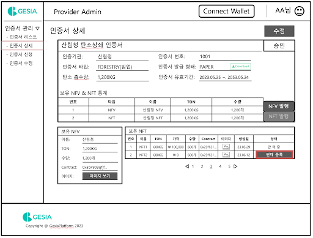

## Abstract
Environmental problems have emerged as a top concern worldwide, prompting the majority of countries to adopt carbon neutrality as a key national policy for resolving environmental issues. Additionally, companies are actively making efforts to reduce carbon emissions and offset them, aiming to solve environmental issues. Such efforts by nations and companies play a critical role in achieving sustainable development.
 

Among these efforts, companies are striving to address environmental problems through the following process: measuring the carbon emissions generated by their services or products. They employ various measurement technologies and systems to accurately calculate emission levels and identify areas where carbon emissions can be reduced at each stage.
 

Aligning carbon emissions in all areas with the allocated emission limits for each company is practically impossible. Therefore, companies purchase carbon emission allowances to address the additional carbon emissions. These purchased carbon emission allowances are utilized in places dedicated to resolving environmental pollution. Furthermore, companies invest in various carbon offset projects that support activities such as forest conservation, renewable energy projects, and energy efficiency projects, which absorb carbon or reduce greenhouse gas emissions. Such investments provide companies with growth potential through ESG (Environmental, Social, and Governance) management. Recently, global companies have been making various efforts to achieve carbon neutrality, aiming to minimize emissions and increase carbon absorption to achieve a net emission of '0'.
 

Among the various carbon offset projects described earlier, Gesia Chain is one project that aims to achieve carbon neutrality through a balance between carbon emissions and offsets. Gesia Chain transparently manages various data necessary for the balance of carbon emissions and offsets. Moreover, it verifies each data using oracle technology, ensuring the reliability of the interconnected links with various companies striving for carbon neutrality. Additionally, it provides connections with global companies practicing ESG management through various public blockchains, forming an ecosystem to continuously address environmental issues. This is made possible through Gesia Chain's carbon neutrality verification protocol, issuance of carbon emission and offset NFTs, transparent transactions, ESG management information recording, and verification technologies.
 
 

## ERD

  
   
    

 

## process flow

  
  
  
  

 

## Carbon offsets issued companies
### Description

> Carbon offsetting companies can issue NFVs and NFTs by registering certificates issued by companies issuing carbon offsetting certificates such as Verra and Gold Standard on the Gesia Platform.
>
> The Gesia Platform leverages blockchain technology to provide a secure and reliable environment for carbon offsetting rights providers to register certificates and issue NFVs and NFTs. This contributes to > more effective distribution of carbon offsets and management of carbon emissions.
>
> Additional explanations below will guide you through how the Gesia Platform provides transparent and secure carbon offset certificates to users.

  

---

> Carbon offset providers are companies that offer carbon offsets to businesses and individuals by registering the carbon offset certificates issued by certification bodies such as Verra and Gold Standard.
>
> Carbon offset issuance companies utilize the registered carbon offsets to issue NFV. NFV represent the carbon offsets as On-Chain data, facilitating the transition of carbon offsets from Off-Chain to On-> > Chain data.
>
> Gesia Platform leverages Chainlink Operator Node to securely and transparently transfer carbon offset Off-Chain data to On-Chain data. The Chainlink Operator Node ensures the reliable processing of carbon > offset data transfers and supports the unique characteristics of blockchain technology.
>
> By clicking the NFV issuance button, NFVs are issued to the wallet connected to the carbon offset provider's account. This wallet serves as a unique identifier and storage for the carbon offset provider, > enabling the storage and management of issued NFVs. For detailed information, please to future refer user guides and documentation provided by Gesia Platform.

API(provider) 
cert apply: (POST) https://test-api.gesiaplatform/v1/cert/certs/{username}
 
cert update: (PATCH) https://test-api.gesiaplatform/v1/cert/certs/{username}/{id}
 
cert request: (GET) https://test-api.gesiaplatform/v1/cert/certs/{username}
 
NFV list request: (GET) https://test-api.gesiaplatform/v1/cert/certs/nfv/{id}
   

  

---

> Carbon offset rights providers can issue non-fungible tokens (NFTs) using NFVs issued. NFTs are specific digital assets, and carbon offsetting companies guarantee a certain amount of NFV by issuing these > NFTs.
>
> To use the NFT Issuance feature, the user can issue an NFT by clicking the NFT Issuance button. At this point, you can issue NFTs at a certain rate. The issued NFTs are owned by the corresponding carbon > > offsetting rights provider, and NFTs are issued to wallets linked to the accounts of the carbon offsetting rights provider.
>
> The issued NFT is generated based on the NFV. NFVs are generated at a 1:N ratio to the actual carbon offset issued by companies issuing carbon offset certificates such as Verra and Gold Standard. This means that the quantity of NFTs issued depends on the amount of NFVs. In other words, NFTs are issued in proportion to the guaranteed amount of NFVs.
>
> The issued NFT has a unique identifier and is recorded on the blockchain. This allows you to track and warrant NFT ownership and transactions. In this way, carbon offsetting rights providers can leverage > NFV to issue NFTs that demonstrate environmental protection and carbon offset.

API(provider) 
cert request: (GET) https://test-api.gesiaplatform/v1/cert/certs/{username}
 
NFV publish apply: (POST) https://test-api.gesiaplatform/v1/cert/certs/{username}/nfv/minting/{id}
 
NFV list request: (GET) https://test-api.gesiaplatform/v1/cert/certs/nfv/{id}
   

  

---

> Carbon offsetting companies may sell issued NFTs to carbon offsetting wholesalers. To this end, the Gesia Platform provides the ability to register your NFTs for sale.
>
> Users can change their NFTs to in-sale status by clicking the Register Sales button to register their NFTs for sale. Sales-registered NFTs will be ready for purchase by carbon offsetting wholesalers.
>
> Carbon offsetting rights wholesalers may purchase NFTs on sale for the purpose of using or selling carbon offset rights. The Gesia Platform allows wholesalers to view NFTs on sale and purchase the desired NFTs.
>
> This allows carbon offsetting companies to trade in the carbon offsetting market by selling their issued NFTs to carbon offsetting wholesalers. These transactions contribute to the circulation and activation of carbon offsetting rights, and support more effective participation and scale-up in carbon offsetting.

API(provider) 
cert request: (GET) https://test-api.gesiaplatform/v1/cert/certs/{username}
 
NFV list request: (GET) https://test-api.gesiaplatform/v1/cert/certs/nfv/{id}
 
NFT publish apply: (POST) https://test-api.gesiaplatform/v1/cert/certs/{username}/nft/minting/{id}
 
NFT list request: (GET) https://test-api.gesiaplatform/v1/cert/certs/nft/{id}
   

  

---

> Carbon offset rights wholesalers can more easily hold carbon offset rights by purchasing NFTs sold by carbon offsetting rights providers.
>
> Wholesale companies own carbon offsetting rights NFTs purchased from carbon offsetting rights providers. You can leverage this to sell to carbon offsetting retailers. Carbon offsetting rights Retailers offer carbon offsetting rights by selling NFTs purchased from wholesalers to consumers or businesses.
>
> Carbon offsetting rights wholesale companies are responsible for purchasing carbon offset rights and distributing them for use in various places. This also helps small businesses and individuals obtain carbon offsetting rights more easily, and contributes to revitalizing the carbon offsetting market and protecting the environment.
>
> This distribution structure allows carbon offsetting rights to reach a wider range of users and effectively operate carbon emission compensation systems.

API(provider) 
cert request: (GET) https://test-api.gesiaplatform/v1/cert/certs/{username}
 
NFV list request: (GET) https://test-api.gesiaplatform/v1/cert/certs/nfv/{id}
 
NFT list request: (GET) https://test-api.gesiaplatform/v1/cert/certs/nft/{id}
 
NFT sell apply: (PATCH) https://test-api.gesiaplatform/v1/cert/certs/{username}/register/{id}
   

  
  

---

> Carbon offsetting rights Retailers are responsible for delivering carbon offset rights from wholesalers to small amounts of needed businesses and individuals to provide carbon offset rights to more diverse users.
>
> Retailers buy a small amount of carbon offsets and offer them to their customers. This helps small businesses or individuals realize the small-scale carbon offsets they need. For example, an individual could purchase a small amount of carbon offsetting rights to offset the carbon emissions generated by his or her daily activities.
>
> Carbon offsetting rights Retailers offer and sell an appropriate amount of carbon offset rights at the buyer's request. This will further extend the opportunity for carbon offsets by transferring the carbon offsets offered by wholesalers to more diverse users.
>
> In addition, retailers are responsible for explaining the information and effectiveness of carbon offsets and for informing customers of the value of carbon offsets. This helps retailers raise awareness of environmental protection and help them achieve carbon neutrality.
>
> Thus, carbon offsetting rights retailers offer a variety of carbon offsetting rights to businesses and individuals who need a small amount of carbon offsetting rights, and encourage more participation in carbon offsetting to help achieve carbon neutrality.

API(provider) 
wholesale NFT request: (GET) https://test-api.gesiaplatform/v1/nft/broker/market
 
wholesale NFT detail history: (GET) https://test-api.gesiaplatform/v1/nft/broker/market/{username}/{id}
 
wholesale NFT buy: (POST) https://test-api.gesiaplatform/v1/nft/broker/buy/{username}/{id}
 
wholesale NFT buy history: (GET) https://test-api.gesiaplatform/v1/nft/broker/market/{username}
 
wholesale NFT buy detail history: (GET) https://test-api.gesiaplatform/v1/nft/broker/market/detail/{username}/{id}
 
wholesale NFT sell apply: (POST) https://test-api.gesiaplatform/v1/nft/broker/market/sale/{username}
 
wholesale NFT sell history: (GET) https://test-api.gesiaplatform/v1/nft/broker/market/sale/detail/{username}
   

  
  

---

> Carbon offsetting retail companies allow companies or individuals to buy carbon offsetting rights and use them wherever they want.
>
> For example, companies can buy and use carbon offsets to offset their own carbon emissions, and individuals can buy and use carbon offsets to compensate for carbon emissions from their daily activities.
>
> As such, the Gesia Platform wants to leverage blockchain technology to facilitate distribution of carbon offsets to carbon offsetting rights to retail, carbon offsetting companies, or individuals to promote carbon neutrality and environmental protection. This creates a sustainable carbon offset market, giving various stakeholders the opportunity to engage in carbon offset activities and compensate for carbon emissions. Through the safety and transparency of blockchain technology, we want to reliably manage the distribution and transaction of carbon offsets, and to be an effective tool to help companies and individuals realize carbon neutrality.

API(provider) 
retail NFT request: (GET) https://test-api.gesiaplatform/v1/nft/broker/market
 
retail NFT detail history: (GET) https://test-api.gesiaplatform/v1/nft/broker/market/{username}/{id}
 
retail NFT buy: (POST) https://test-api.gesiaplatform/v1/nft/broker/buy/{username}/{id}
 
retail NFT huy history: (GET) https://test-api.gesiaplatform/v1/nft/broker/market/{username}
 
retail NFT buy detail history: (GET) https://test-api.gesiaplatform/v1/nft/broker/market/detail/{username}/{id}
 
retail NFT sell apply: (POST) https://test-api.gesiaplatform/v1/nft/broker/market/sale/{username}
 
retail NFT sell history: (GET) https://test-api.gesiaplatform/v1/nft/broker/market/sale/detail/{username}
   

  

